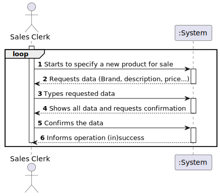
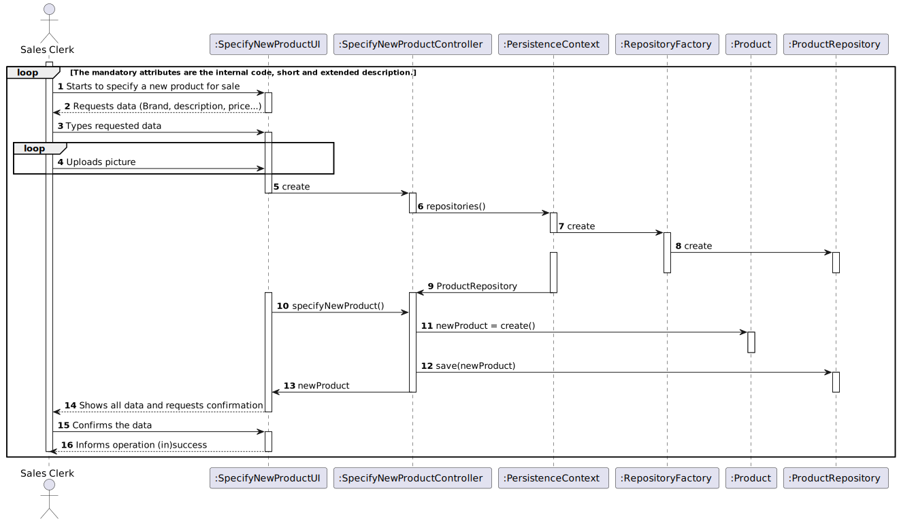
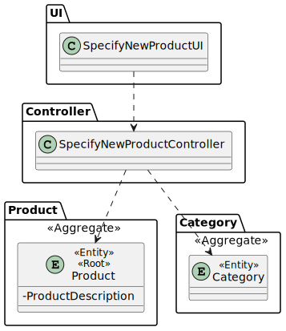

# **US1001 - As Sales Clerk, I want to specify a new product for sale.**

=======================================

# 1. Requirements

**US1001 - As Sales Clerk, I want to specify a new product for sale.**

The interpretation made of this user story was that the sales clerk wants to specify a new product for sale.
For this, he must start by requesting the system to specifying a new product for sale, and he must introduce the data for that product.
At the end the system shows all the data and asks for confirmation.

##Acceptance Criteria

* A product must have:
> - a photo: it might be of any common format (e.g. png, jpeg, svg);
>
> - a short description: not empty having 30 chars maximum;
>
> - an extended description: not empty with a minimum of 20 chars and 100 chars maximum;
>
> - a technical description: multiple lines of text, preferably with no limit or the biggest possible.
>
> - a brand: not empty having 50 chars maximum;
>
> - a reference: not empty alphanumeric code with at 23 chars maximum;
>
> - a production code: not empty alphanumeric code with at 23 chars maximum however it might meet a given regular expression defined/configured at deployment time.
>
> - an internal code: not empty alphanumeric code with at 23 chars maximum however it might meet a given regular expression defined/configured at deployment time.
>
> The mandatory attributes are the internal code, short and extended description.

>Question: Still regarding the barcode should the identifier be sequential, if not what method should we use to generate the identifier?
>
>Answer: Barcodes are manually introduced by users since each product barcode is provided by the product manufacture.

# 2. Analysis

* For specifying a new product, the sales clerk must request all the data needed to specify the new product.

* The system should be prepared to alert the sales clerk in case any of this information already exists on the system.

# 3. Design

>   Domain classes: Product
>
>   Controller: SpecifyNewProductController
>
>   UI: SpecifyNewProductUI
> 
>   Repository: ProductRepository

## 3.1. Functionality Realization

## 3.2. Class Diagram

## 3.4. Tests
*Nesta secção deve sistematizar como os testes foram concebidos para permitir uma correta aferição da satisfação dos requisitos.*

**Teste 1:** Verificar que não é possível criar uma instância da classe Exemplo com valores nulos.

	@Test(expected = IllegalArgumentException.class)
		public void ensureNullIsNotAllowed() {
		Exemplo instance = new Exemplo(null, null);
	}

# 4. Implementation

*Nesta secção a equipa deve providenciar, se necessário, algumas evidências de que a implementação está em conformidade com o design efetuado. Para além disso, deve mencionar/descrever a existência de outros ficheiros (e.g. de configuração) relevantes e destacar commits relevantes;*

*Recomenda-se que organize este conteúdo por subsecções.*

# 5. Demonstration

*Nesta secção a equipa deve descrever os esforços realizados no sentido de integrar a funcionalidade desenvolvida com as restantes funcionalidades do sistema.*

# 6. Observations

*Nesta secção sugere-se que a equipa apresente uma perspetiva critica sobre o trabalho desenvolvido apontando, por exemplo, outras alternativas e ou trabalhos futuros relacionados.*

