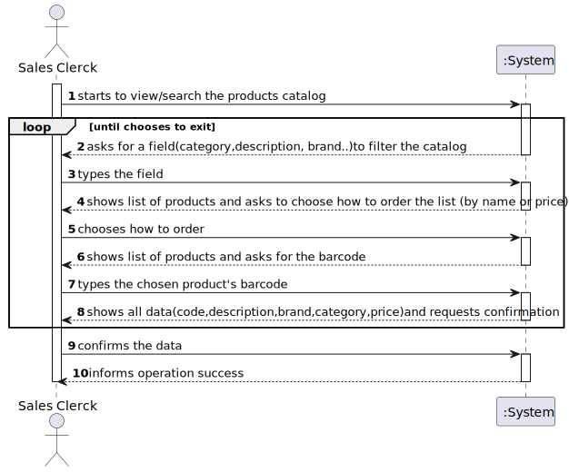
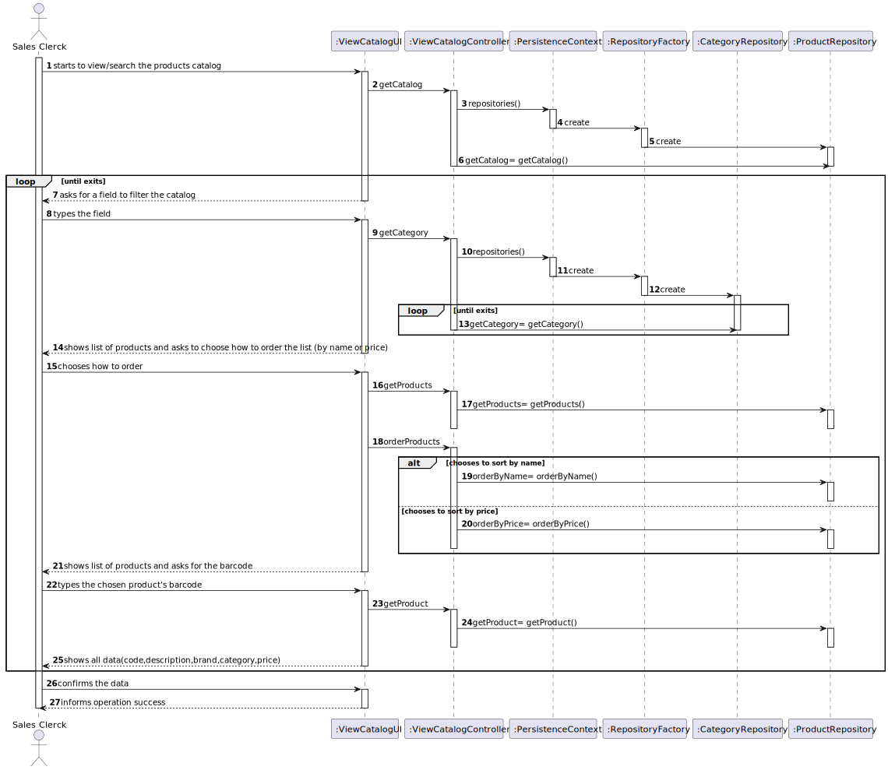
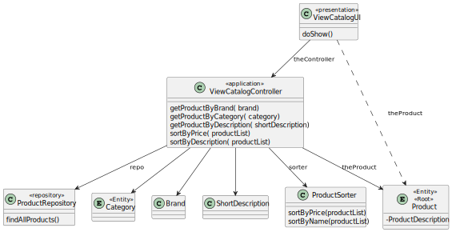

# US1002
=======================================

# 1. Requirements

**US1002** As Sales Clerk, I want to view/search the products catalog.

The interpretation made of this requirement was that the sales clerck wishes to view the products of the catalog, and/or search 
for a specific one and its details.
They start by filtering all the products using a category, description and/or brand, then the data should appear ordered,
by price or alphabetically. Finally, the product must be chosen so that the details can be viewed.

## Acceptance criteria
* Commonly fields used to filter products are: Category, Description (any of the available descriptions) e Brand
* User should select/specify a data presentation order. This applies to any similar US.
* At least the product' code, short description, brand, category and unit price should be presented.
* More details can be presented for a given/selected product at user request.
* The project must be prepared to easily support several currencies.
* The system should work adopting a base currency (e.g.: EUR) and, according to the customer location, be able to present 
prices on other currencies (e.g. USD) using an external currency converter.
* During the prototype development, using a currency converter should not be a major concern.
* Data to be used to filter the products catalog content should be asked ahead.
* Regarding presentation order, the necessary data can be asked either: ahead and after presenting them

# 2. Analysis
* To complete this user story, the us1001 (responsable for specifying a new product for sale) and us1005 (responsible for 
defining a new category of products) are going to be necessary so that the sales clerck can view the products of the catalog, 
and/or search for a specific one and its details. 
* The sales clerck should be able to filter the catalog by category, brand and/or a short description, after this, the data 
should be ordered. The ordering method can be decided either, right after choosing the filters or after showing the filtered catalog.
* The selected product from the organised catalog must have the product's code,a short description, brand, category and unit price in the details,
having in mind this price, the merchandise should support several currencies and depending on the location of the client change from the base currency(EUR).

# 3. Design
* Utilizar a estrutura base standard da aplicação baseada em camadas 

>   Classes do domínio: Category, Product, Barcode, Brand, ShortDescription, ProductPriceDetail
>
>   Controlador: ViewCatalogController
>
>   Repository:  ProductRepository

## 3.1. Realização da Funcionalidade

## 3.2. Diagrama de Classes

*Nesta secção deve apresentar e descrever as principais classes envolvidas na realização da funcionalidade.*

## 3.3. Padrões Aplicados

*Nesta secção deve apresentar e explicar quais e como foram os padrões de design aplicados e as melhores práticas.*

## 3.4. Testes
*Nesta secção deve sistematizar como os testes foram concebidos para permitir uma correta aferição da satisfação dos requisitos.*

**Teste 1:** Verificar que não é possível criar uma instância da classe Exemplo com valores nulos.

	@Test(expected = IllegalArgumentException.class)
		public void ensureNullIsNotAllowed() {
		Exemplo instance = new Exemplo(null, null);
	}

# 4. Implementação

*Nesta secção a equipa deve providenciar, se necessário, algumas evidências de que a implementação está em conformidade com o design efetuado. Para além disso, deve mencionar/descrever a existência de outros ficheiros (e.g. de configuração) relevantes e destacar commits relevantes;*

*Recomenda-se que organize este conteúdo por subsecções.*

# 5. Integração/Demonstração

    public List<Product> getProductByBrand(Brand brand) {
        return productRepository.findByBrand(brand);
    }

    public List<Product> getProductByCategory(Category category) {
        return productRepository.findByCategory(category);
    }

    public List<Product> getProductByDescription(ShortDescription shortDescription) {
        return productRepository.findByDescription(shortDescription);
    }
# 6. Observações

*Nesta secção sugere-se que a equipa apresente uma perspetiva critica sobre o trabalho desenvolvido apontando, por exemplo, outras alternativas e ou trabalhos futuros relacionados.*

