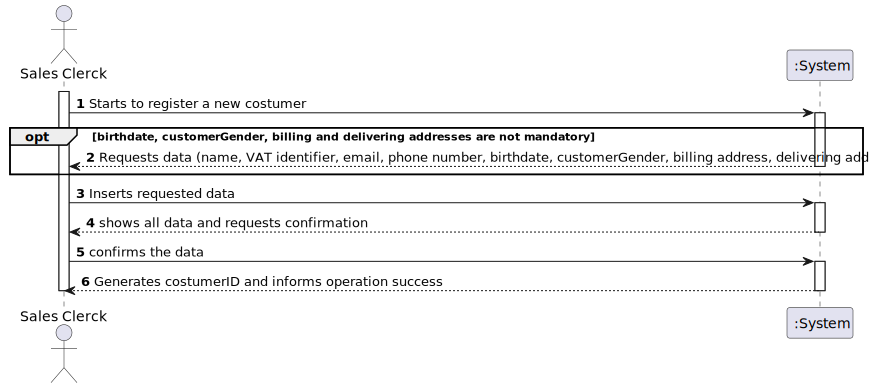
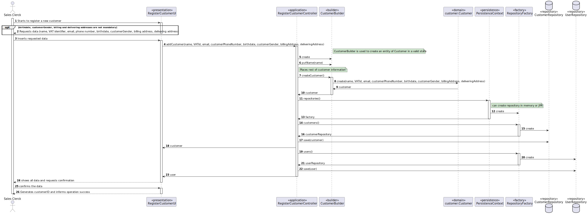
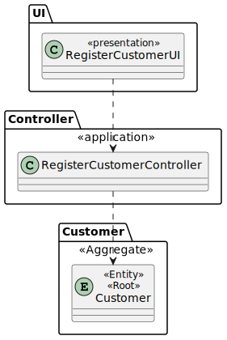

# US1003
=======================================

# 1. Requirements

**US1003** As Sales Clerk, I want to register a new customer.

Within the scope of this user story, the task of registering a new customer is assigned to the sales clerk. 
As such, the costumer must provide at least the first and last name, a valid Value-Added Tax (VAT) identifier that varies from 
one country to another so the system must be prepared to support/recognize several VAT Ids, an email address and a phone number.
Optionally, customers might state their birthdate, customerGender and have/manage several billing and delivering postal addresses,
including a street name, door number, postal code, city and country.

## Acceptance criteria
* At least the first and last name of the customer are required for their registration
* Besides the name of the customer, a VAT, an  email address and a phone number are required for their registration
* Birthdate, customerGender  and billing/delivering adresses are  optional for costumers registration 
* The system must be prepared to support/recognize several VAT Ids

# 2. Analysis

* For registering a new costumer, a sales clerk must request them a handful of personal details such as their name, VAT identifier, email address and phone number
* The system should be prepared to alert the sales clerk in case any of this information already exists on the system
* The customer can optionally add more information to the registration in case they wish to, being the sales clerk responsibility to give them this option
* Customers information should be double-checked by the sales clerk before ending the registration

# 3. Design

>   Domain Classes: Costumer, CustomerFirstName, CustomerLastName, CustomerEmailAddress, CustomerPostalAddress, CustomerPhoneNumber, CustomerBirthday, CustomerGender, CustomerVatIdentifier
>
>   Controller: RegisterCustomerController
>
>   Repository: CostumerRepository

## 3.1. Realização da Funcionalidade

## 3.2. Diagrama de Classes

## 3.3. Padrões Aplicados

*Nesta secção deve apresentar e explicar quais e como foram os padrões de design aplicados e as melhores práticas.*

## 3.4. Testes 
*Nesta secção deve sistematizar como os testes foram concebidos para permitir uma correta aferição da satisfação dos requisitos.*

**Teste 1:** Verificar que não é possível criar uma instância da classe Exemplo com valores nulos.

	@Test(expected = IllegalArgumentException.class)
		public void ensureNullIsNotAllowed() {
		Exemplo instance = new Exemplo(null, null);
	}

# 4. Implementação

*Nesta secção a equipa deve providenciar, se necessário, algumas evidências de que a implementação está em conformidade com o design efetuado. Para além disso, deve mencionar/descrever a existência de outros ficheiros (e.g. de configuração) relevantes e destacar commits relevantes;*

*Recomenda-se que organize este conteúdo por subsecções.*

# 5. Integração/Demonstração

*Nesta secção a equipa deve descrever os esforços realizados no sentido de integrar a funcionalidade desenvolvida com as restantes funcionalidades do sistema.*

# 6. Observações

*Nesta secção sugere-se que a equipa apresente uma perspetiva critica sobre o trabalho desenvolvido apontando, por exemplo, outras alternativas e ou trabalhos futuros relacionados.*

