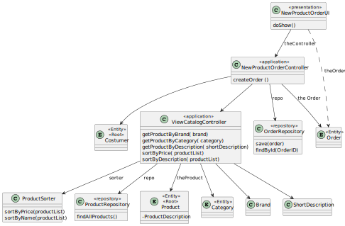

# US1004
=======================================

# 1. Requirements

**US1004** As Sales Clerk, I want to create a new product's order on behalf of a given customer.

The interpretation made of this requirement was that the sales clerck wishes to choose some products from the catalog and make an order 
on behalf of a given costumer.
In order to succeed they must start by filtering all the products using a category, description and/or brand, then the data should appear ordered,
by price or alphabetically. 
Finally, the product must be chosen so that the details can be viewed and it can be added to the shopping cart, in there the final price can be viewed with the shipping costs
and the payment method chosen to end the process.

## Acceptance criteria
* Commonly fields used to filter products are: Category, Description (any of the available descriptions) e Brand
* User should select/specify a data presentation order. This applies to any similar US.
* At least the product' code, short description, brand, category and unit price should be presented.
* More details can be presented for a given/selected product at user request.
* The project must be prepared to easily support several currencies.
* The system should work adopting a base currency (e.g.: EUR) and, according to the customer location, be able to present prices on other currencies (e.g. USD) using an external currency converter.
* During the prototype development, using a currency converter should not be a major concern.
* Data to be used to filter the products catalog content should be asked ahead.
* Regarding presentation order, the necessary data can be asked either: ahead and after presenting them

# 2. Analysis
* To complete this user story, the us1001 (responsable for specifying a new product for sale), us1003 (responsable for registering a new customer) and us1005 (responsible for
  defining a new category of products) are going to be necessary so that the sales clerck can create a new product's order on behalf of a given customer.
* To make a new order, the sales clerck must start by choosing and adding the desired products to the shooping cart, this being possible by going through the exact same steps as the us1002.
* Therefore, he must first filter the catalog by category, brand and/or a short description, after this, the data
  should be ordered. The ordering method can be decided either, right after choosing the filters or after showing the filtered catalog.
* The selected product from the organised catalog must have the product's code,a short description, brand, category and unit price in the details,
  having in mind this price, the merchandise should support several currencies and depending on the location of the client change from the base currency(EUR).
* Finally he should add the items to the shopping cart so that the main process of the order can begin. The final and total price of the order 
is to be verified, having already included the transportation taxes, that depend on the location of  the costumer and shipping method.
* To end the process, a payment method must be chosen.

# 3. Design
* Utilizar a estrutura base standard da aplicação baseada em camadas

>   Classes do domínio: Category, Product, SalesRegion, PriceTable, PriceItem,Costumer, PaymentMethod,ShoppingCart
>
>   Controlador: NewProductOrderController
>
>   Repository: CategoryRepository, ProductRepository, SalesRegionRepository, PriceTableRepository,PriceItemRepository,CostumerRepository,PaymentMethodRepository,ShoppingCartRepository

*Nesta secção a equipa deve descrever o design adotado para satisfazer a funcionalidade.  identificação de padrões aplicados e quais foram os principais testes especificados para validar a funcionalidade.*

## 3.1. Realização da Funcionalidade

*Nesta secção deve apresentar e descrever o fluxo/sequência que permite realizar a funcionalidade.*

## 3.2. Diagrama de Classes

*Nesta secção deve apresentar e descrever as principais classes envolvidas na realização da funcionalidade.*

## 3.3. Padrões Aplicados

*Nesta secção deve apresentar e explicar quais e como foram os padrões de design aplicados e as melhores práticas.*

## 3.4. Testes
*Nesta secção deve sistematizar como os testes foram concebidos para permitir uma correta aferição da satisfação dos requisitos.*

**Teste 1:** Verificar que não é possível criar uma instância da classe Exemplo com valores nulos.

	@Test(expected = IllegalArgumentException.class)
		public void ensureNullIsNotAllowed() {
		Exemplo instance = new Exemplo(null, null);
	}

# 4. Implementação

*Nesta secção a equipa deve providenciar, se necessário, algumas evidências de que a implementação está em conformidade com o design efetuado. Para além disso, deve mencionar/descrever a existência de outros ficheiros (e.g. de configuração) relevantes e destacar commits relevantes;*

*Recomenda-se que organize este conteúdo por subsecções.*

# 5. Integração/Demonstração

    public ProductOrder registerNewOrder(OrderActor orderActor, OrderID orderID, Customer customer, Calendar dateTime, LineOrder lineOrder, PriceOrder priceOrder, PaymentMethod paymentMethod, ShippingMethod shippingMethod, Status status) {
        authorizationService.ensureAuthenticatedUserHasAnyOf(BaseRoles.POWER_USER, BaseRoles.ADMIN, BaseRoles.SALES_CLERK_USER);

        txCtx.beginTransaction();

        ProductOrder productOrder = orderService.registerNewOrder(orderActor, orderID, customer, dateTime, lineOrder, priceOrder, paymentMethod, shippingMethod, Status.REGISTERED);

        txCtx.commit();

        return productOrder;
    }

# 6. Observações

*Nesta secção sugere-se que a equipa apresente uma perspetiva critica sobre o trabalho desenvolvido apontando, por exemplo, outras alternativas e ou trabalhos futuros relacionados.*

