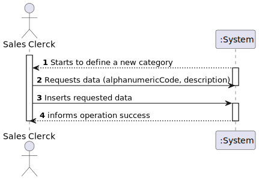
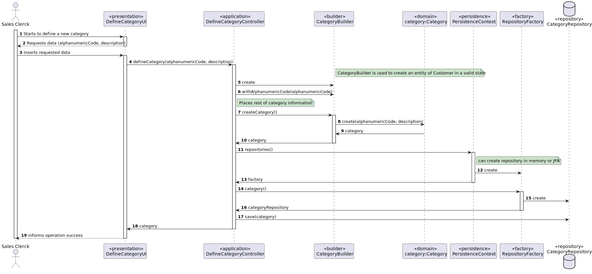
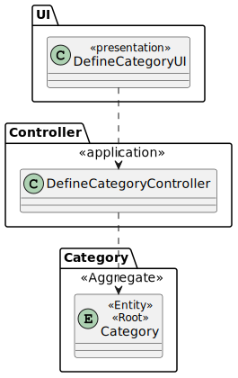

# US1005
=======================================

# 1. Requirements

*Nesta secção a equipa deve indicar a funcionalidade desenvolvida bem como descrever a sua interpretação sobre a mesma e sua correlação e/ou dependência de/com outros requisitos.*

*Exemplo*

**US1005** As Sales Clerk, I want to define a new category of products.

Within the scope of this user story, the task of defining a new category is assigned to the sales clerk.
As such, the sales clerk inserts an alphanumeric code and a description for the category they wish to define.

## Acceptance criteria

* code: not empty alphanumeric code with at 10 chars maximum;
* description: not empty with a minimum of 20 chars and 50 chars maximum;

# 2. Analysis

* Defining a new category only requires the sales clerk to insert a code and a description.
* In this case, we assume a product only has one category, but a category many products.
* One category can also have sub-categories.

# 3. Design

>   Domain Classes: Category
>
>   Controller: DefineCategoryController
>
>   Repository: CategoryRepository

## 3.1. Realização da Funcionalidade

## 3.2. Diagrama de Classes

*Nesta secção deve apresentar e descrever as principais classes envolvidas na realização da funcionalidade.*

## 3.3. Padrões Aplicados

*Nesta secção deve apresentar e explicar quais e como foram os padrões de design aplicados e as melhores práticas.*

## 3.4. Testes
*Nesta secção deve sistematizar como os testes foram concebidos para permitir uma correta aferição da satisfação dos requisitos.*

**Teste 1:** Verificar que não é possível criar uma instância da classe Exemplo com valores nulos.

	@Test(expected = IllegalArgumentException.class)
		public void ensureNullIsNotAllowed() {
		Exemplo instance = new Exemplo(null, null);
	}

# 4. Implementação

*Nesta secção a equipa deve providenciar, se necessário, algumas evidências de que a implementação está em conformidade com o design efetuado. Para além disso, deve mencionar/descrever a existência de outros ficheiros (e.g. de configuração) relevantes e destacar commits relevantes;*

*Recomenda-se que organize este conteúdo por subsecções.*

# 5. Integração/Demonstração

*Nesta secção a equipa deve descrever os esforços realizados no sentido de integrar a funcionalidade desenvolvida com as restantes funcionalidades do sistema.*

# 6. Observações

*Nesta secção sugere-se que a equipa apresente uma perspetiva critica sobre o trabalho desenvolvido apontando, por exemplo, outras alternativas e ou trabalhos futuros relacionados.*

