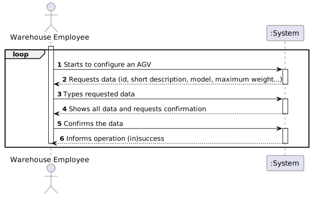
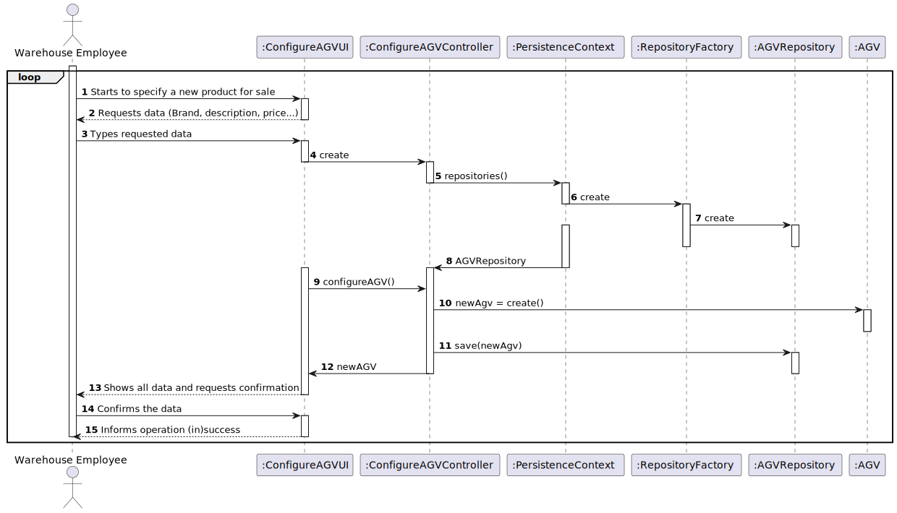
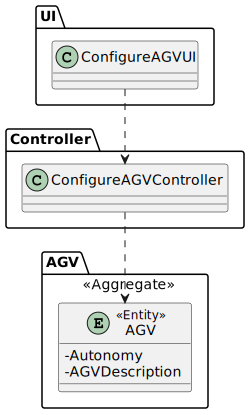

# **2002- As Warehouse Employee, I want to configure the AGVs available on the warehouse.**

=======================================

# 1. Requirements

**2002- As Warehouse Employee, I want to configure the AGVs available on the warehouse.**

The interpretation made of this user story was that the warehouse employee want to configure the AGVs available on the warehouse.
For this, he must start by requesting the system to configuring the AGV, and he must introduce the data.
At the end the system shows all the data and asks for confirmation.

##Acceptance Criteria

* An AGV must have:
> - an identifier
> - a short description
> - a model 
> - a maximum weight
> - a base location   
> - a status 
> - an autonomy 
> - a current task

> - Question: "A single AGV dock, no matter how large, can only be the base for one AGV robot?"
> 
> - Answer: Yes. That is correct.

> - Question: "There is a need to each AVG has its own avg dock?"
> 
> - Answer: The same AGV dock can not be used by two (or more) distinct AGVs.

# 2. Analysis

* For configuring an AGV, the warehouse employee must request all the data needed to configure.
* The system should be prepared to alert the warehouse employee in case any of this information already exists on the system.

# 3. Design

>   Domain classes: AGV
>
>   Controller: ConfigureAGVController
> 
>   UI: ConfigureAGVUI
>
>   Repository: AGVRepository

## 3.1. Functionality Realization

## 3.2. Class Diagram

## 3.4. Tests
*Nesta secção deve sistematizar como os testes foram concebidos para permitir uma correta aferição da satisfação dos requisitos.*

**Teste 1:** Verificar que não é possível criar uma instância da classe Exemplo com valores nulos.

	@Test(expected = IllegalArgumentException.class)
		public void ensureNullIsNotAllowed() {
		Exemplo instance = new Exemplo(null, null);
	}

# 4. Implementation

*Nesta secção a equipa deve providenciar, se necessário, algumas evidências de que a implementação está em conformidade com o design efetuado. Para além disso, deve mencionar/descrever a existência de outros ficheiros (e.g. de configuração) relevantes e destacar commits relevantes;*

*Recomenda-se que organize este conteúdo por subsecções.*

# 5. Demonstration

*Nesta secção a equipa deve descrever os esforços realizados no sentido de integrar a funcionalidade desenvolvida com as restantes funcionalidades do sistema.*

# 6. Observations

*Nesta secção sugere-se que a equipa apresente uma perspetiva critica sobre o trabalho desenvolvido apontando, por exemplo, outras alternativas e ou trabalhos futuros relacionados.*

