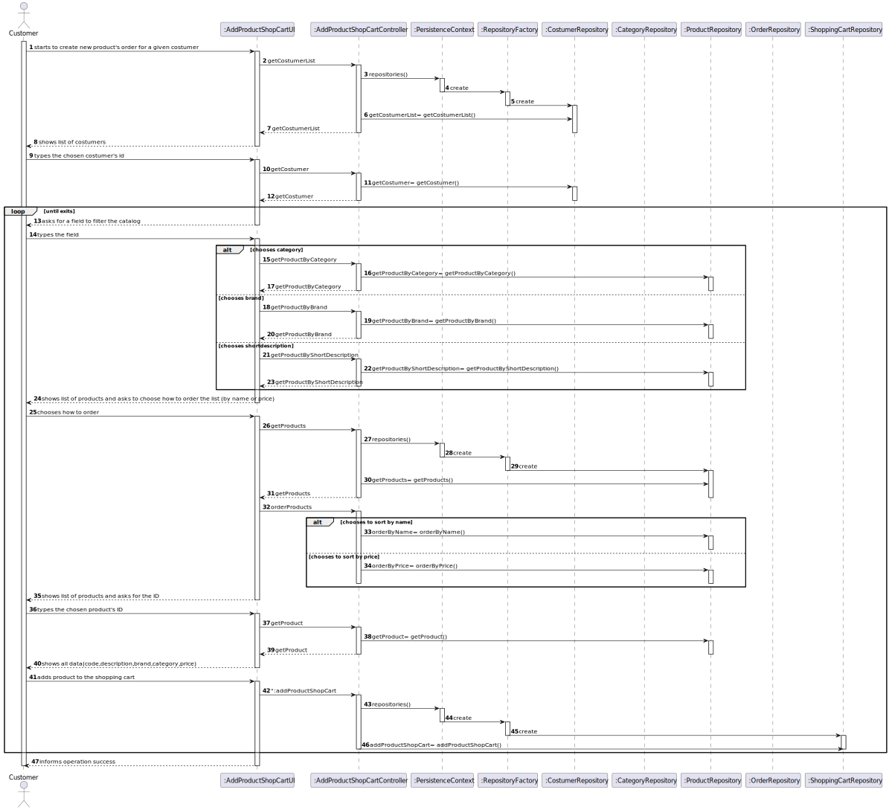

# US1002
=======================================

# 1. Requirements

**US1501** As Customer, I want to view/search the product catalog and be able to add a product to the shopping cart.

The interpretation made of this requirement was that the customer wishes to view the products of the catalog, and/or search 
for a specific one and its details.
They start by filtering all the products using a category, description and/or brand, then the data should appear ordered,
by price or alphabetically. Finally, the product must be chosen so that the details can be viewed.
After this, if they want to buy it, they must be able to add the product to the shopping cart.

## Acceptance criteria
* It is mandatory using the "OrdersServer" component (cf. US1901).

# 2. Analysis
* To complete this user story, the us1001 (responsable for specifying a new product for sale), us1005 (responsible for 
defining a new category of products), the  us1901 (responsable for the "OrdersServer" component) and the  us1002 (responsable for 
viewing the catalog) are going to be necessary so that the customer can view the products of the catalog, 
and/or search for a specific one and its details and add them to the shopping cart.

# 3. Design
* Utilizar a estrutura base standard da aplicação baseada em camadas 

>   Classes do domínio: Category, Product, Barcode, Brand, ShortDescription, ProductPriceDetail
>
>   Controlador: ViewCatalogController
>
>   Repository:  ProductRepository

## 3.1. Realização da Funcionalidade

## 3.2. Diagrama de Classes

*Nesta secção deve apresentar e descrever as principais classes envolvidas na realização da funcionalidade.*

## 3.3. Padrões Aplicados

*Nesta secção deve apresentar e explicar quais e como foram os padrões de design aplicados e as melhores práticas.*

## 3.4. Testes
*Nesta secção deve sistematizar como os testes foram concebidos para permitir uma correta aferição da satisfação dos requisitos.*

**Teste 1:** Verificar se duas brands sao iguais

	  @Test
    void testEquals() throws IllegalAccessException {
        Brand b= new Brand("oi");
        Brand bo= new Brand("oi");
        Assertions.assertEquals(bo.toString(), b.toString());
    }

# 4. Implementação

*Nesta secção a equipa deve providenciar, se necessário, algumas evidências de que a implementação está em conformidade com o design efetuado. Para além disso, deve mencionar/descrever a existência de outros ficheiros (e.g. de configuração) relevantes e destacar commits relevantes;*

*Recomenda-se que organize este conteúdo por subsecções.*

# 5. Integração/Demonstração

    public List<Product> getProductByBrand(Brand brand) {
        return productRepository.findByBrand(brand);
    }

    public List<Product> getProductByCategory(Category category) {
        return productRepository.findByCategory(category);
    }

    public List<Product> getProductByDescription(ShortDescription shortDescription) {
        return productRepository.findByDescription(shortDescription);
    }
# 6. Observações

*Nesta secção sugere-se que a equipa apresente uma perspetiva critica sobre o trabalho desenvolvido apontando, por exemplo, outras alternativas e ou trabalhos futuros relacionados.*

