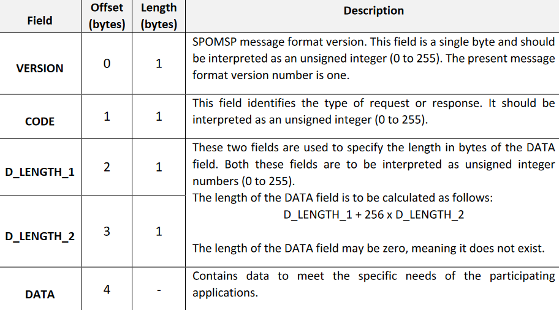
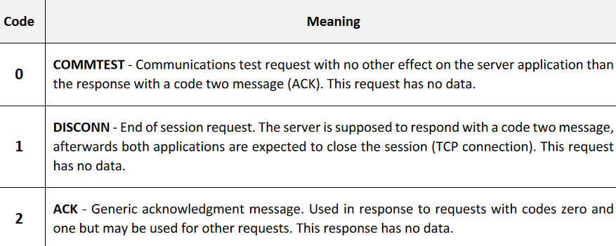
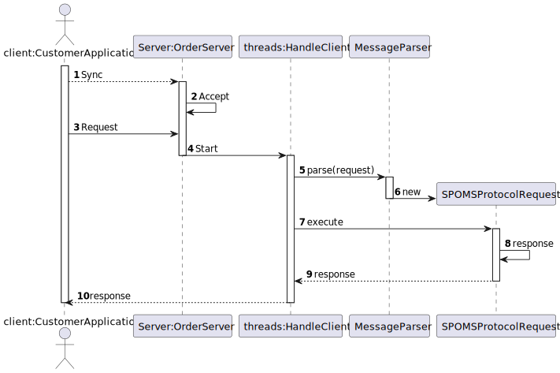

# US1901
=======================================

# 1. Requirements

**US1901** As Project Manager, I want that the "OrdersServer" component supports properly, at request, the needs of the "CustomerApp" application.

The interpretation made of this requirement was that the project manager wishes that the server application, called 
“Orders Server”, responsible to fulfill the all the data requests necessary to the “Customer Application” works properly. 
The set of available/possible requests must be minimized and, each one, should have a very specific purpose (e.g.: add a 
product to the shopping cart, check the status of his/her open orders).

## Acceptance criteria
* It must be used the provided application protocol (SPOMS2022).
* It is suggested the adoptiong of concurrent mechanisms (e.g. threads) and state sharing between these mechanisms.
* In this sprint, for demonstration purposes, it is acceptable to mock processing some of the incoming requests.
* Every request (sent by the client) has a mandatory response (sent by the server), both share a
same message format described ahead
* Once established, the TCP connection between client and server is kept alive and used for all
requests needed while the client application is running
* Every data exchange through the TCP connection (requests and responses) must comply with the
bytes sequence description in Table

# 2. Analysis
* To complete this user story, the us1001 (responsable for specifying a new product for sale),the  us1002 (responsable for
viewing the catalog), the us1004 (responsable for registering new orders) and us1005 (responsible for 
defining a new category of products) are going to be necessary.
* This user story focuses on data exchange through TCP connection that may be asked from the customers point of view, for example
checking the status of his/her open orders... 
* Once a TCP connection is established, the client-server relation persists and only the client
application is allowed to take the initiative of sending data, i.e.: a request. The server application
must be passively waiting for a request and only then is authorized to send data, i.e.: a response,
to the received request.

* List of some message codes that must be implemented by every application using
SPOMSP.
  

# 3. Design
* Utilizar a estrutura base standard da aplicação baseada em camadas 

>   Classes do domínio: Category, Product, Barcode, Brand, ShortDescription, ProductPriceDetail
>
>   Controlador: ViewCatalogController
>
>   Repository:  ProductRepository

## 3.1. Realização da Funcionalidade

## 3.3. Padrões Aplicados

* This functionality will be provided with a server socket on a well-known address using TCP as transport mecanism.

# 4. Implementação

    public static void main(String args[]) throws Exception {
      int i;

            try {
                sock = new ServerSocket(1111);
            } catch (IOException ex) {
                System.out.println("Local port number not available.");
                System.exit(1);
            }

            while (true) {
                Socket s = sock.accept(); // wait for a new client connection request
                addCli(s);
                Thread cli = new OrderServerClient(s);
                cli.start();
            }
        }
    }

