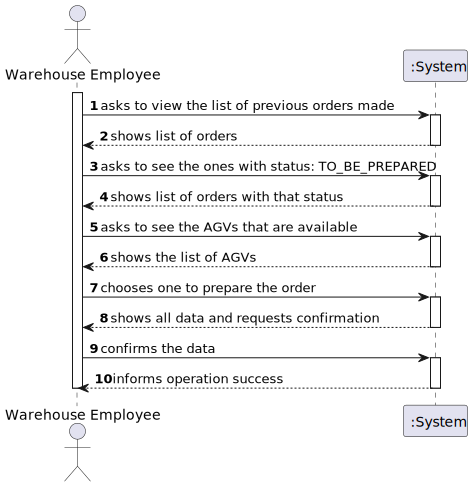
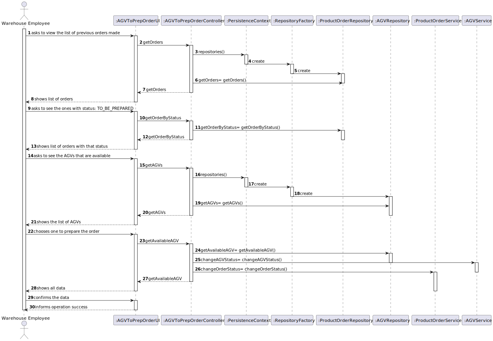
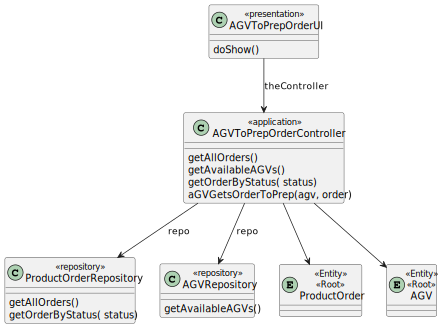

# US2003
=======================================

# 1. Requirements

**US2003** As Warehouse Employee, I want to access the list of orders that need to be prepared by an AGV and be able to ask/force any of those orders to be immediately prepared by an AGV available.

The interpretation made of this requirement was that the sales clerck wishes to view the products of the catalog, and/or search 
for a specific one and its details.
They start by filtering all the products using a category, description and/or brand, then the data should appear ordered,
by price or alphabetically. Finally, the product must be chosen so that the details can be viewed.

## Acceptance criteria
* In the scope of US 2003, the AGV is selected by the warehouse employee from the ones that are available and are able to perform the task.
* The warehouse employee is able to: 
* (i) select an order that needs to be prepared; 
* (ii): select the AGV from the ones that are available and able to perform the task; 
* (iii) the task is sent to the selected AGV and 
* (iv) the order change its status.

# 2. Analysis
* To complete this user story, the us1004 (responsable for registering new orders) and us2002 (responsible for configuring the AGVs) are going to be necessary.
* The warehouse employee should be able to access the list of previous orders and check their status to see which ones need to be 
prepared by an AGV (in the status to be prepared)
* After this, they must check the AGVs and seek the available ones to ask/force any of those orders to be immediately prepared by one of them (Status becomes: being_prepared)

# 3. Design
* Utilizar a estrutura base standard da aplicação baseada em camadas 

>   Classes do domínio: ProductOrder, AGV
>
>   Controlador: AGVToPrepOrderController
>
>   Repository:  ProductOrderRepository AGVRepository

## 3.1. Realização da Funcionalidade

## 3.2. Diagrama de Classes

## 3.3. Padrões Aplicados

Repository factory to store in database and controller.

## 3.4. Testes
**Teste 1:** Change the status of an agv

    @Test
    void changeStatus() {
        Identifier id = new Identifier("1");
        AGV agV = new AGV(id, 70,agvDock,"auto", model, maxWeightCarry, Status.FREE );
        agV.changeStatus(Status.CHARGING);
        Assertions.assertEquals(Status.CHARGING, agV.getStatus());
    }

# 4. Implementação

* I implemented the domain classes based on the domain model created and that I needed for the US implementation. 
* I created the controller, repository and UI so that it was possible for the warehouse employee to complete this
  task of giving an order to be prepared to an agv. 

# 5. Integração/Demonstração

    public AGV agvToPrepOrder(AGV agv,ProductOrder productOrder) {
        agv.changeOrder(productOrder);
        agv.changeStatus(Status.OCCUPIED);
        agvRepository.save(agv);
        return agv;
    }
# 6. Observações

