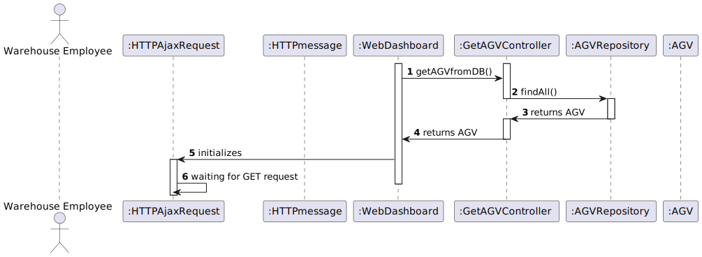

# **US2005**

=======================================

# 1. Requirements

**US2005** - As Warehouse Employee, I want to open a web dashboard presenting the current status of the AGVs as well as their position in the warehouse layout and keeps updated automatically.

## Acceptance criteria

* It must be used the provided application protocol (SPOMS2022).
* The dashboard is intended to be displayed on a web page provided by an existing HTTP server in the "BackOfficeApp" application and only available to localhost.
* The dashboard web page is kept updated without reloading.

> Question: How would you like the dashboard to look? A simple list of the AGVS along with its position and status?
>
> Answer: No! Preferably, the dashboard should be an approximation to what is depicted on Figure 8 of the specifications document.

> Question: Should the HTTP server be part of the "BackOfficeApp" and communicate with the AGV Manager using the REQUESTS_API?
> 
> Answer: The "backoffice Application" (or one of its components) must, somehow, get the data from the "AGV Manager" (and/or the system database).

# 2. Analysis

- The dashboard is intended to be displayed on a web page provided by an existing HTTP server in the "BackOfficeApp" application and only available to localhost.
- The dashboard web page is kept updated without reloading.

# 3. Design

>   Domain classes: AGV
>
>   Controller: GetAGVController
>
>   Repository: AGVRepository

## 3.1. Realization of Functionality

## 3.3. Applied Patterns

The used patterns was the Controller and GRASP.

# 4. Implementação

    private static List<AGV> getAGVfromDB(){
        GetAGVController ctrl = new GetAGVController();
        Iterator<AGV> AGVit = ctrl.findAll().iterator();
        List<AGV> AGVList = new ArrayList<>();
        while(AGVit.hasNext()){
            AGVList.add(AGVit.next());
        }
        return AGVList;
    }

# 5. Integração/Demonstração

*Nesta secção a equipa deve descrever os esforços realizados no sentido de integrar a funcionalidade desenvolvida com as restantes funcionalidades do sistema.*

# 6. Observações

*Nesta secção sugere-se que a equipa apresente uma perspetiva critica sobre o trabalho desenvolvido apontando, por exemplo, outras alternativas e ou trabalhos futuros relacionados.*

