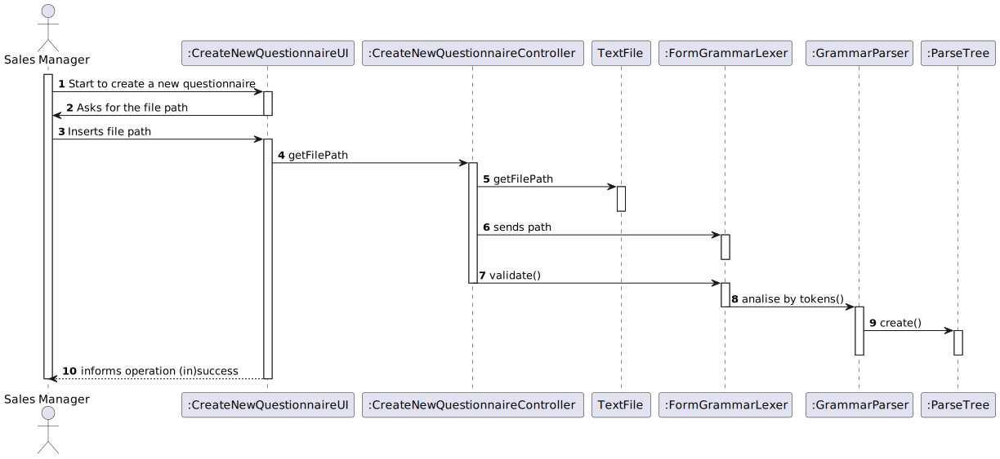

# **US3001**

=======================================

# 1. Requirements

**US3001** - As Sales Manager, I want to create a new questionnaire to be further answered by customers meeting the specified criteria.

## Acceptance criteria

* The set of questions/answers composing the questionnaire should be expressed and validated (parsed) using the grammar being developed for this purpose (US3000).

>Question: What are the constraints to the survey alphanumeric code and the description?
>
>Answer:
> - Code: alphanumeric value with 15 chars max;
>
> - Description: non-empty short sentence (e.g.: 40 chars).

> Questions: 
> - 1. The same section can be present in more than one questionnaire?
> - 2. The same question can be present in more than one section?
> 
> Answer: Yes, that can happen.
>
> However, there is no intend to reutilize questions and/or sections. 
> If that happens, the user will type the question/section again.

# 2. Analysis
- The questionnaire should be developed according to the needs of each team. There are several types of questionnaires that 
can be made following a structure, and taking into account the indications given in the system specification document.
- For creating a new questionnaire, the Sales Manager should choose the path to the Questionnaire text file and then the system will validate the respective Questionnaire.

# 3. Design

>   Domain classes: FormGrammarLexer, FormGrammarParser
>
>   Controller: CreateNewQuestionnaireController
>
>   UI: CreateNewQuestionnaireUI

## 3.1. Realization of Functionality

## 3.2. Applied Patterns

The used patterns was the Controller and GRASP.

## 3.3. Testes
*Nesta secção deve sistematizar como os testes foram concebidos para permitir uma correta aferição da satisfação dos requisitos.*

**Teste 1:** Verificar se duas brands sao iguais

	  @Test
    void testEquals() throws IllegalAccessException {
        Brand b= new Brand("oi");
        Brand bo= new Brand("oi");
        Assertions.assertEquals(bo.toString(), b.toString());
    }

# 4. Implementação

*Nesta secção a equipa deve providenciar, se necessário, algumas evidências de que a implementação está em conformidade com o design efetuado. Para além disso, deve mencionar/descrever a existência de outros ficheiros (e.g. de configuração) relevantes e destacar commits relevantes;*

*Recomenda-se que organize este conteúdo por subsecções.*

# 5. Integração/Demonstração

*Nesta secção a equipa deve descrever os esforços realizados no sentido de integrar a funcionalidade desenvolvida com as restantes funcionalidades do sistema.*

# 6. Observações

*Nesta secção sugere-se que a equipa apresente uma perspetiva critica sobre o trabalho desenvolvido apontando, por exemplo, outras alternativas e ou trabalhos futuros relacionados.*

