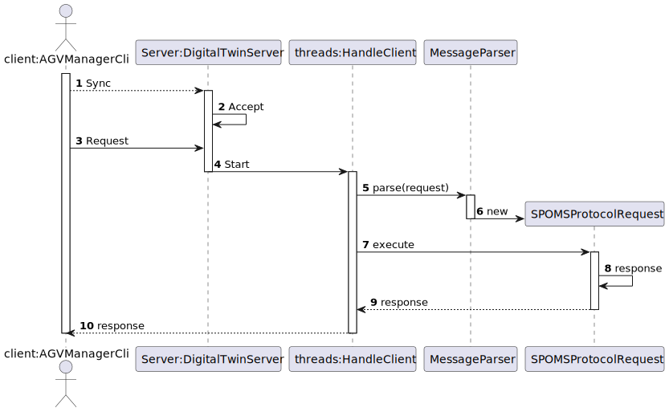

# US5001
=======================================

# 1. Requirements

**US5001** As Project Manager, I want that the team start developing the input communication module of the AGV digital twin to accept requests from the "AGVManager".

* For this US it's intended that the AGV Digital Twin communicates with the AVG Manager, being able to accept its requests.

## Acceptance criteria
* It must be used the provided application protocol (SPOMS2022).
* It is suggested the adoptiong of concurrent mechanisms (e.g. threads) and state sharing between these mechanisms.
* In this sprint, for demonstration purposes, it is acceptable to mock processing some of the incoming requests to foster some output communication.

# 2. Analysis

- For starters, there needs to be created two new modules, one for the AGV DigitalTwin and one for the AGV Manager.
- This modules must be able to communicate with one another using sockets.
- When creating a socket, the port number for the client and server must be the same.
- For demonstration purposes we'll use "localhost" two facilitate the communication.

# 3. Design

>   Server: DigitalTwinServer
>
>   Client: AgvManagerCli

## 3.1. Realization of Functionality

# 4. Implementation

>    DigitalTwinServer

    public static void main(String args[]) throws Exception {
        int i;

        try {
            sock = new ServerSocket(2222);

        } catch (IOException ex) {
            System.out.println("Local port number not available.");
            System.exit(1);
        }

        while (true) {
            Socket s = sock.accept(); // wait for a new client connection request
            addCli(s);
            Thread cli = new TcpChatSrvClient(s);
            cli.start();
        }
    }

>    DigitalTwinServer

    public static void main(String args[]) throws Exception {
        int i;

        try {
            sock = new ServerSocket(2222);

        } catch (IOException ex) {
            System.out.println("Local port number not available.");
            System.exit(1);
        }

        while (true) {
            Socket s = sock.accept(); // wait for a new client connection request
            addCli(s);
            Thread cli = new TcpChatSrvClient(s);
            cli.start();
        }
    }

