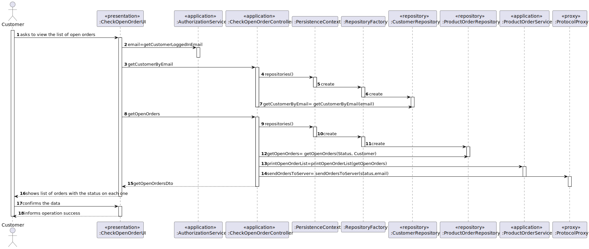

# US1502
=======================================

# 1. Requirements

**US1502** As Customer, I want to view/check the status of my open orders.

The interpretation made of this requirement was that the customer wishes to view/check the status of his open orders.

## Acceptance criteria
* It is mandatory using the "OrdersServer" component (cf. US1901).
* Check the status of my (customer) orders. 
* All the customer orders that have not yet been marked as “delivered” should be presented to the customer.
* On orders having a “delivered by carrier” status, it might be possible the customer marks such orders as “delivered”.

# 2. Analysis
* To complete this user story, the  us1901 (responsible for the "OrdersServer" component) and the  us1004 (responsible for 
creating a new products order on behalf of a given customer) are going to be necessary so that the customer can 
view/check the status of his open orders.
* They start by asking for the list of the open orders and in the list it is shown the status of each.

# 3. Design
* Utilizar a estrutura base standard da aplicação baseada em camadas 

>   Classes do domínio: ProductOrder Status
>
>   Controlador:  CheckOpenOrderController   ;
>
>   Repository:   OrderRepository
>
>   Service:  OrderService
> 
>  Server: OrderServer
>
>   Client: CustomerAppCli

## 3.1. Realization of Functionality

## 3.2. Patterns

Repository, factory, controller,GRASP, proxy and service

## 3.3. Tests
**Teste 1:** buscar o status da order

      @Test
    void getStatus() {
        ProductOrder order = new ProductOrder(o, orderID, c, d, lineOrder, po, PaymentMethod.MBWAY, ShippingMethod.Blue, Status.REGISTERED);
        Assertions.assertEquals(Status.REGISTERED, order.getStatus());
    }

# 4. Implementation

* I implemented the domain classes based on the domain model created and that I needed for the US implementation.
* I created UI and used the controller,repository and service so that it was possible for the customer to complete this
task of viewing and checking the status of his open orders.

# 5. Integration

   

