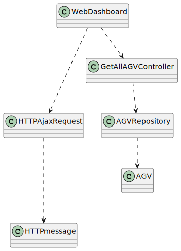
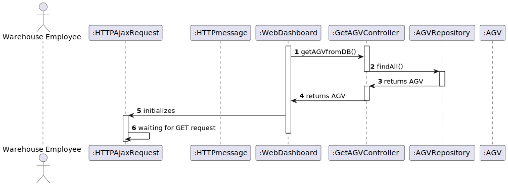

# **US2006 - As Project Manager, I want the communications made through the SPOMS2022 protocol to be secured/protected.**

=======================================

# 1. Requirements

**US2006** - As Project Manager, I want the communications made through the SPOMS2022 protocol to be secured/protected.

## Acceptance criteria

* It should be adopted SSL/TLS with mutual authentication based on public key certificates.
* It complements the US2005.

> At the moment there are no questions on the customer forum

# 2. Analysis

- The dashboard is intended to be displayed on a web page provided by an existing HTTP server in the "BackOfficeApp" application and only available to localhost.
- The dashboard web page is kept updated without reloading.

# 3. Design

>   Domain classes: AGV
>
>   Controller: GetAGVController
>
>   Repository: AGVRepository

## 3.1. Realization of Functionality

### Class Diagram(CD)

### Sequence Diagram(SD)

## 3.2. Applied Patterns

The used patterns was the Controller, Repository and GRASP.

# 4. Implementação

    private static List<AGV> getAGVfromDB(){
        GetAGVController ctrl = new GetAGVController();
        Iterator<AGV> AGVit = ctrl.findAll().iterator();
        List<AGV> AGVList = new ArrayList<>();
        while(AGVit.hasNext()){
            AGVList.add(AGVit.next());
        }
        return AGVList;
    }

# 5. Integração/Demonstração

*Nesta secção a equipa deve descrever os esforços realizados no sentido de integrar a funcionalidade desenvolvida com as restantes funcionalidades do sistema.*

# 6. Observações

*Nesta secção sugere-se que a equipa apresente uma perspetiva critica sobre o trabalho desenvolvido apontando, por exemplo, outras alternativas e ou trabalhos futuros relacionados.*

