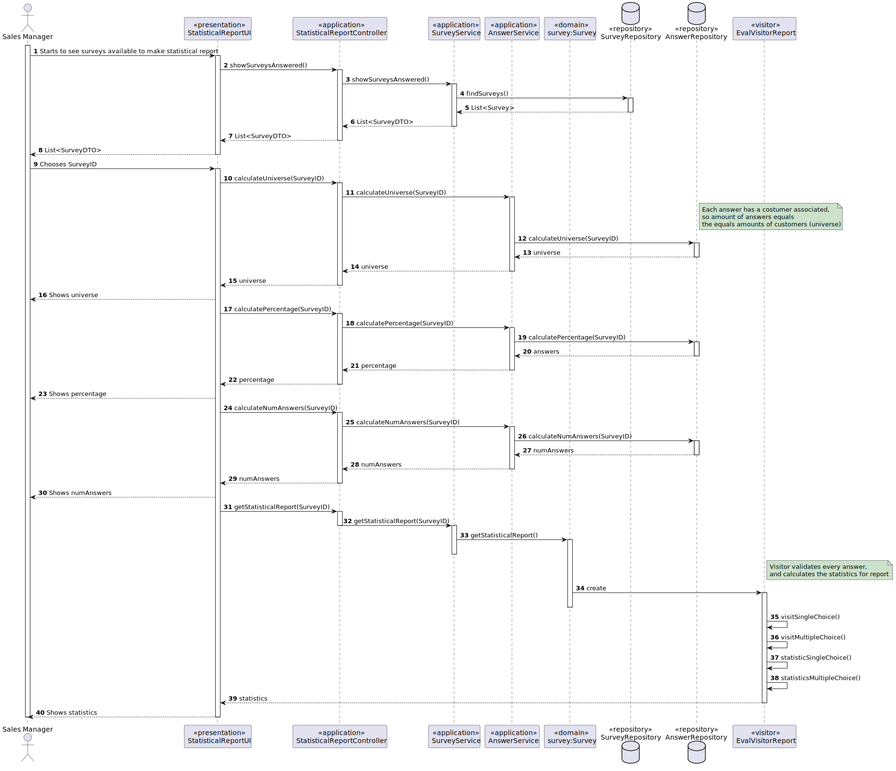
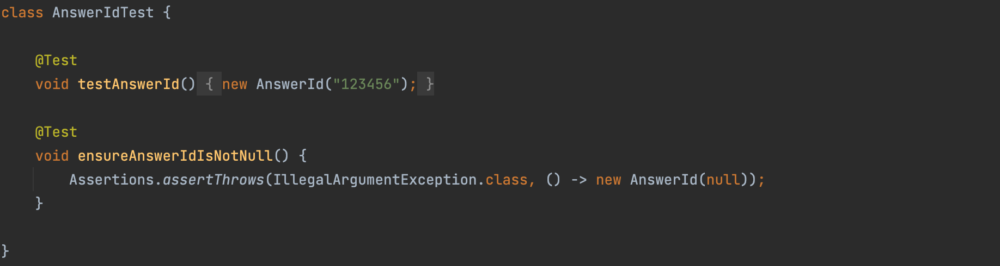
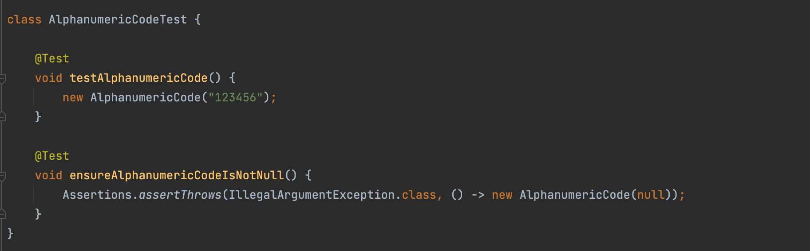
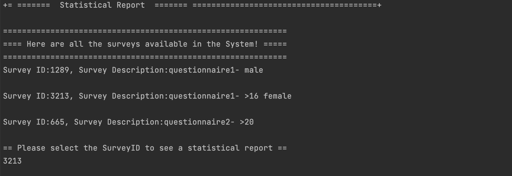
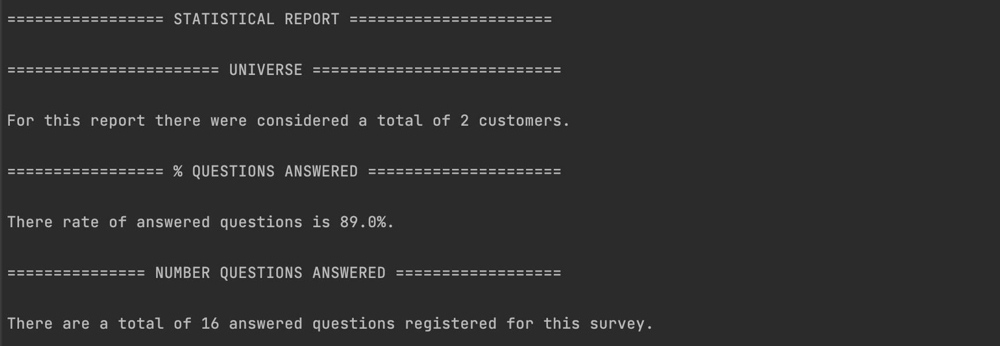
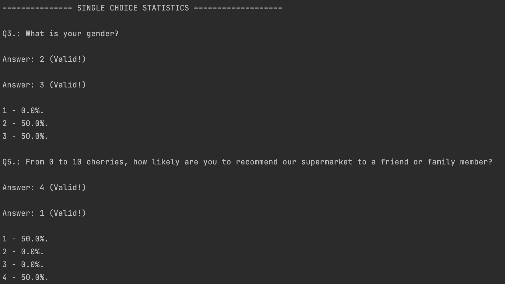
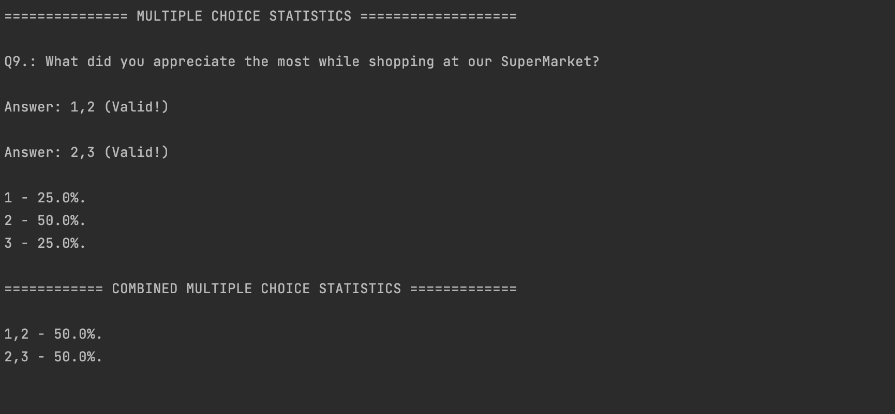

# US3002
=======================================

# 1. Requirements

**US3002** As Sales Manager, I want to get a statistical report regarding a previously set up questionnaire.

* Within the scope of this user story, the Sales Manager wants to have a statistical overview report of a certain questionnaire.
* In this report are stated the size of the universe being considered, including the ammount of users that responded as well as the amount of answers.
* For each question, the Sales Clerk can see the percentage that each choice was selected.

## Acceptance criteria
>Every survey report must state:
* Universe being considered (number of people that responded);
* Number of questions answered;
* % of questions answered;

>For Single-Choice questions:
* Distribution (in %) of responses for each alternative (e.g.: A = 30%, B = 27%, C = 40%, Others = 3%) (number of options varies from question to question);

>For Multiple-Choice questions:
* Distribution (in %) of responses for each alternative (e.g.: A = 30%, B = 27%, C = 40%, Others = 3%);
* Distribution (in %) of combined responses (e.g.: A+B = 15%, A+C = 100%, B+C=100%, A+B+C=10%);

>For Sorting questions:
* Distribution of the various hypotheses for each position (e.g.: 1st Place = A(40%) B (60%) C(0%); 2nd Place = A(50%) B(40%) C(10%); 3rd Place= A(10%) C(90%));

>For Scaling questions:
* Distribution of each option by scale levels;

# 2. Analysis

* This US depends on the US 3001 that creates the questionnaires and the US 3501 that registers the answers to them.
* For this US, the previously answered survey, chosen by the sales manager, serves as a base to validate the answers of the customers.
* Using the visitors, the system iterates through every type of question (except free text) and compares it tho the answer given by a given customer.
* In case that answer is correct, that answer will be accounted for in the statistics of a given type of question.
* When all the answers are accounted for, the system calculates the statistics shown in the final report.

# 3. Design

>   Domain Classes: Survey, Answer
>
>   Controller: StatisticalReportController
>
>   Service: SurveyService, AnswerService
>
>   Repository: SurveyRepository, AnswerRepository
> 
>   UI: StatisticalReportUI
> 
>   Visitor: EvalVisitorReport

## 3.1. Functionalities

## 3.3. Patterns applied

* For this US the applied patterns were: GRASP, controller, service ,visitor

## 3.4. Tests 

* Unit Tests:

* Functional Tests:

# 4. Observations

* The statistical report does not encompass sorting nor scaling type statistics.

