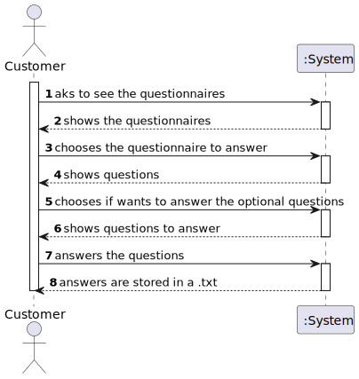

# US3501
=======================================

# 1. Requirements

**US3501** As Customer, I want to get the list of questionnaires that the system is asking me to answer and be able to answer any of those questionnaires.

The interpretation made of this requirement was that the questionnaires will be shown and the customer will choose which to answer. 

## Acceptance criteria

* Notice that the UI should be generated dynamically in accordance to the given questionnaire. 
* I.e. que UI is generated by interpreting the input questionnaire.
* The answers should be saved in a raw text format to be further processed/analyzed.

# 2. Analysis
* The interpretation made of this requirement was that the questionnaires will be shown and the customer will choose one to answer. 
* The answers will determine the questionnaire and the rest of its questions.
* The UI should be generated dynamically in accordance to the given questionnaire.
* The answers should be saved in a raw text format to be further processed/analyzed.

# 3. Design

## 3.1. Realization of Functionality

# 4. Implementation

* Creation of a .txt file that included the answers of a questionnaire made by the customer and, accompanied by a .g4 grammar
that analyzed and was able to read and define a questionnaire.
* Created UI so that it was possible for the customer to complete this
task of answering the questionnaires.

# 5. Integration

