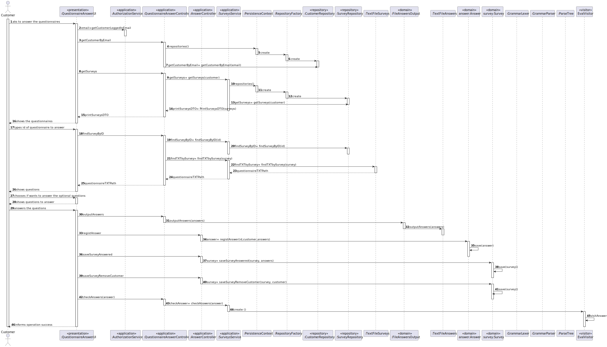

# US3501
=======================================

# 1. Requirements

**US3501** As Customer, I want to get the list of questionnaires that the system is asking me to answer and be able to answer any of those questionnaires.

The interpretation made of this requirement was that the questionnaires will be shown and the customer will choose which to answer. 

## Acceptance criteria

* Notice that the UI should be generated dynamically in accordance to the given questionnaire. 
* I.e. que UI is generated by interpreting the input questionnaire.
* The answers should be saved in a raw text format to be further processed/analyzed.
* It would be nice to specify more than one condition in the same rule and have more than one rule
* A direct connection to the database (graphically depicted on red) must be avoid. Instead, data requests should be made through the “Orders API” exposed by the “Orders Server” component.
* A server application, called “Orders Server”, responsible to fulfill the all the data requests necessary to the “Customer Application” works properly.

# 2. Analysis
* The interpretation made of this requirement was that the questionnaires will be shown and the customer will choose one to answer. 
* The answers will determine the questionnaire and the rest of its questions.
* The UI should be generated dynamically in accordance to the given questionnaire.
* The answers should be saved in a raw text format to be further processed/analyzed.

# 3. Design

>   Domain Classes: Survey, Answer
>
>   Controller: QustionnaireAnswerController AnswerController
>
>   Service: SurveyService, AnswerService
>
>   Repository: SurveyRepository, AnswerRepository
>
>   UI: QuestionnaireAnswerUI
>
>   Visitor: EvalVisitor

## 3.1. Realization of Functionality

## 3.2. Patterns

Repository, factory, controller,GRASP,service and DTO

# 4. Implementation

* Creation of a .txt file that included the answers of a questionnaire made by the customer and, accompanied by a .g4 grammar
that analyzed and was able to read and define a questionnaire.
* Created UI so that it was possible for the customer to complete this
task of answering the questionnaires.
* Read the questionnaire using the scanner and asked to answer the questions,while answering the text is stored in a list that is 
checked by the grammar using visitors.
* They are tranformed in the object type Answer and stored in the database.

# 5. Integration
    public String checkAnswer(String answers) throws IOException {
        //FileInputStream fis = new FileInputStream(new File(CharStreams.fromString(answers));
        FormGrammarLexer lexer = new FormGrammarLexer(CharStreams.fromString(answers));
        org.antlr.v4.runtime.CommonTokenStream tokens = new CommonTokenStream(lexer);
        FormGrammarParser parser = new FormGrammarParser(tokens);
        EvalVisitor eval = new EvalVisitor();
        ParseTree tree = parser.start(); // parse
        return eval.visit(tree);
    }

