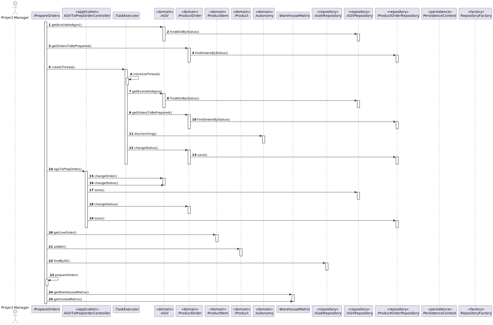

# US5100
=======================================

# 1. Requirements

**US5100** As Project Manager, I want that the team to develop and integrate the others components/parts of the AGV digital twin (e.g.: movement, obstacle sensors, control unit).

This US is intended for any Project Manager that wishes to create a system that controls all the movements of an AGV, including sensors, its position as well as taking into account
the plant of the warehouse where it circulates and its autonomy.

## Acceptance criteria
* In conformity with SCOMP guidelines.
* The source location (starting point) is the position where the AGV is at that moment (as you said, it might be the AGV dock)
* The target location (end point) might be the location of a product.
* When the AGV is moving battery consumption might be computed based on the travelled distance, but when the AGV is waiting/stopped 
on its dock battery consumption might be computed based on time.
* Choose a speed that allows to see the movement of the AGV on the screen;
* You should define your charging and discharging model. A simplified linear model is perfectly adequate for the problem.
* Define your charging and discharging parameters according to your model.

> Question: What is the difference between having one or two sensors, in each corner? How do we differentiate between them? Are they in the same position?
>
> Answer: 
> - Each sensor is a source of information to signal (or not) the presence of an obstacle (e.g.: another AGV, an aisle, etc.).
>
> - In each corner there is a sensor to evaluate obstacles in the front and another sensor  to evaluate obstacles on the side.

> Question: How should we measure the charging of an AGV should it have a certain percentage per minute or per hour?
>
> Answer: You should adopt "seconds" as time unit.

# 2. Analysis
- The Project Manager can use a way of communicating with the system, where it informs you every 100ms of the position of an AGV, which obstacles surround it, all this through shared memory.
- There are motion simulators that take into account all the above.
- AGV speed varies depending on your model. There must be a minimum, average and maximum speed.
- The AGV must slow down enough so that it does not collide, that is, when it encounters an obstacle 2 squares away.

# 3. Design
* Use the standard base structure of the layer-based application.

* Controller: AGVToPrepOrderController
* Domain: AGV, Product Order, Autonomy, Product, Line Order
* Repositories: AGVRepository, ProductOrderRepository, AisleRepository

## 3.1. Realization of Functionality

## 3.3. Applied Patterns

The used patterns was the Controller, Repository and GRASP.

## 3.4. Tests

**Test 1:** 

    @Test
    void compareTo() throws IllegalAccessException {
        Autonomy a1 = new Autonomy(100);
        Autonomy a2 = new Autonomy(100);
        Assertions.assertEquals(0, a1.compareTo(a2));
    }

    @Test
    void testToString() throws IllegalAccessException {
        Autonomy a = new Autonomy(100);
        Assertions.assertEquals("Autonomy: 100", a.toString());
    }

    @Test
    void ensureAutonomyIsNotEmpty() {
        Assertions.assertThrows(IllegalArgumentException.class, () -> new Autonomy());
    }
    
    @Test
    void ensureAutonomyIsBetween0And100() {
        Assertions.assertThrows(IllegalArgumentException.class, () -> new Autonomy(100));
    }
    

# 4. Implementation

* 

# 5. Integration/Demonstration

   

# 6. Observações

